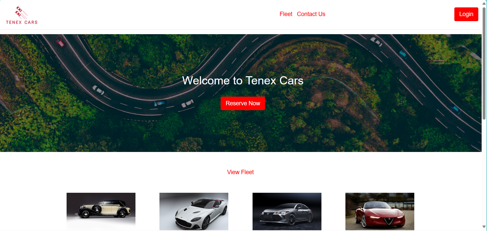

---
# Tenex Cars

Tenex Cars is a **Car Rental Web Application** that connects users with a fleet of advertised and available cars for rent. 
Users can explore vehicle details, filter options, make payments, and reserve vehicles of their choice. 
It also acts as a hub for car rental companies to manage their operations, including adding vehicle details, 
managing subscriptions, and communicating with customers.

---

## Table of Contents
1. [Features](#features)
   - [Subscriber Features](#subscribers-features)
   - [Operator Features](#operator-features) 
2. [Pages Overview](#pages-overview)
   - [Account](#account)
   - [Home](#home)
   - [Operator](#operator)
   - [Pay](#pay)
   - [Subscriber](#subscriber)
   - [Subscription](#subscription)
   - [Vehicle](#vehicle)
3. [User Flow](#user-flow)
   - [Subscribers](#subscribers)
   - [Operators](#operators)
4. [Technologies Used](#technologies-used)
5. [Installation and Setup Instructions](#installation-and-setup-instructions)
6. [Screenshots](#screenshots)

---

## Features

### Subscriber Features
 - View available vehicles and filter by name, model, type, or company.
 - Reserve cars by providing personal and payment details.
 - Make payments securely using Paystack integration.
 - Manage reservations and view subscription history.

### Operator Features
 - Add, edit, and manage vehicle details.
 - View and manage subscribers, subscription statuses, and vehicle inventory.
 - Assign and approve reservations.
 - Add or remove operator members and manage their roles.
 - View detailed statistics on subscriptions, vehicles, and active users.

---

## Pages Overview

### Account
 - Login: User login page with role-based redirection.
 - SetNewPassword: For operator members to set passwords upon invitation.

### Home
 - Index: Homepage.
 - AboutUs: Information about the company.
 - Help: FAQ section.
 - Testimonies: Client reviews and testimonials.

### Operator
 - CarDetails: View detailed information about a specific vehicle.
 - CreateVehicle: Add a new vehicle to the operator’s fleet.
 - Edit: Edit existing vehicle details.
 - Home: Displays all vehicles for the operator.
 - ManageOperatorMembers: Manage operator members and assign roles.
 - OperatorDashboard: Displays statistics, with navigation links to operator pages.
 - OperatorInventoryPage: Lists vehicles under the operator.
 - OperatorProfileSettings: View and edit operator profile details.
 - Vehicles: Displays vehicles without active subscriptions.

### Pay
 - Index: Displays subscriber payment details.
 - Payments: Payment confirmation page.
 - Verify: Verifies the payment and confirms the transaction status.

### Subscriber
 - ActiveSubscription: View active subscriptions and cancel them if needed.
 - CompleteReservation: Fill in reservation details and proceed to payment.
 - NewSubscription: Displays available vehicles for reservation.
 - PostReservation: Confirmation page after payment.
 - Profile: View subscriber details and manage subscriptions.
 - ReserveCar: Page for reserving a car.
 - SubscriptionHistory: View subscription history.

### Subscription
 - OperatorSubscribers: View subscriber information under an operator.
 - OperatorSubscription: Manage subscription details.

### Vehicle
 - FleetOfCars: View all available vehicles and reserve them.

---

## User Flow

### Subscribers

 - New users navigate the homepage and can view available vehicles or register by reserving a car.
 - After reserving, users complete their reservation and proceed to payment.
 - Upon successful payment, the user is redirected to a confirmation page.
 - Logged-in subscribers can view active subscriptions, subscription history, and available vehicles.

### Operators

 - Operators log in and access their dashboard.
 - From the dashboard, they can navigate to:
 - View and manage vehicles.
 - Approve, assign, or decline subscriptions.
 - Manage operator members and add new vehicles.
 - View subscription and subscriber details.
 - Change their profile settings or log out.

---

## Technologies Used

 - Frontend: HTML, CSS, JavaScript, Bootstrap, Razor Syntax.
 - Backend: C#, .NET Core, ASP.NET MVC.
 - Database: PostgreSQL with Entity Framework.
 - APIs & Integrations: Paystack, Cloudinary, JWT Authentication.
 - Others: Swagger, Serilog, Docker, MailKit.

---

## Installation & Setup Instructions

1. Clone the repository:
   - Copy the repository's web URL: "https://github.com/Floren-teena/TenexCars.git"

2. Use Microsoft Visual Studio application to open the project:
   - Navigate to the top right corner labelled "Get started" and click on "Clone a repository"
   - paste the repository URL

3. Use PostgreSQL Database (Install if you don't have):
   - Download and install PostgreSQL from official website: "https://www.postgresql.org/"

4. Update the appsettings.json file:
   - Edit the ConnectionStrings section in appsettings.json with your database connection details.

5. Set up the Database:
   - Navigate to the Tools section at the top
   - Select NuGet Package Manager
   - Select Package Manager Console
   - In the console, select TenexCars.DataAccess as the default project
   - Add migrations by pasting this code after deleting the existing Migration folder: 
	 - Add-Migration InitialMigration
   - Update the database:
	 - Update-Database

6. Run the project:
   - Start the project in Visual Studio. Test the application locally using the provided features.

---

## Screenshots/Assets

